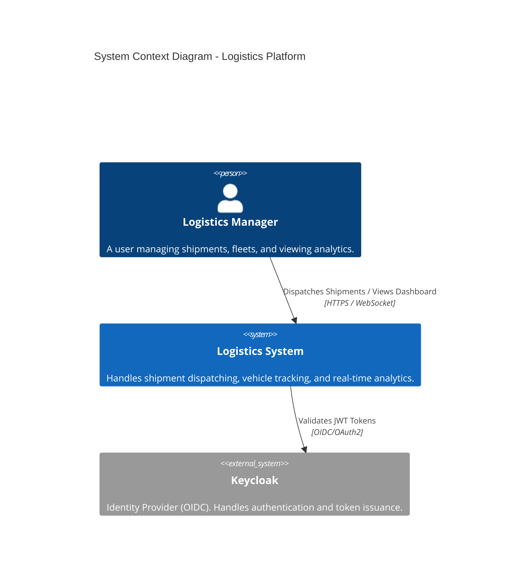
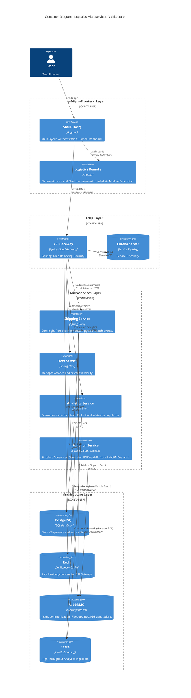
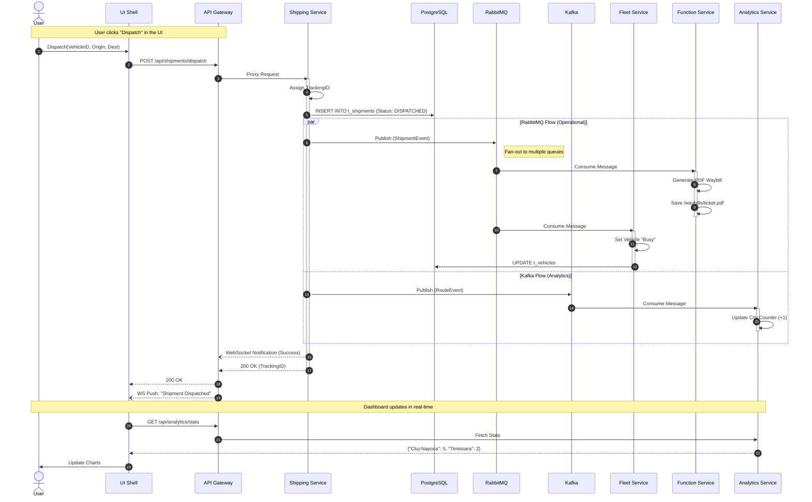

Logistics Management System - Documentation
## 1. System Overview
   The Logistics Management System is a distributed, cloud-native application designed to manage shipments, track vehicle fleets, and analyze route popularity in real-time. It employs an Event-Driven Microservices Architecture to decouple operations, ensuring high availability and scalability.

Key Features:

Micro-Frontend UI: A Shell application dynamically loads the Shipping/Fleet module.

Event Streaming: Kafka is used for high-volume analytics ingestion (Route Popularity).

Message Brokering: RabbitMQ handles asynchronous fleet status updates and document generation.

FaaS Integration: A serverless-style function generates Waybill PDFs on demand.

## 2. C4 Model: System Context
   This diagram illustrates the high-level interactions between the Logistics Manager (User) and the System.

## 3. C4 Model: Container Diagram
This diagram details the internal components, showing how the Micro-Frontends communicate with the Backend Services via the API Gateway.

## 4. UML Sequence Diagram: The "Dispatch Shipment" Flow
This diagram demonstrates the flow we just debugged: Synchronous storage combined with Asynchronous messaging (RabbitMQ & Kafka).

## 5. Technology Stack Summary

| Component         | Technology            | Role                                                                           |
|-------------------|-----------------------|--------------------------------------------------------------------------------|
| Frontend Host     | Angular 17            | Shell application, Authentication, WebSocket client.                           |
| Frontend Remote   | Angular 17            | Logistics Module (Shipment Forms, Fleet List), exposed via Module Federation.  |
| Gateway           | Spring Cloud Gateway  | Entry point, Security (OAuth2 Resource Server), Client-Side Load Balancing.    |
| Discovery         | Netflix Eureka        | Dynamic service registration and discovery.                                    |
| Shipping Service  | Spring Boot           | Core domain logic. Produces messages to RabbitMQ and Kafka.                    |
| Fleet Service     | Spring Boot           | Manages vehicles. Consumes RabbitMQ events to update vehicle availability.     |
| FaaS              | Spring Cloud Function | RabbitMQ Consumer. Stateless function that generates PDF Waybills.             |
| Analytics Service | Spring Boot + Kafka   | Kafka Consumer. Aggregates route data for the dashboard.                       |
| Infrastructure    | Docker Compose        | Orchestration of Postgres, Redis, RabbitMQ, Kafka, Zookeeper, and Keycloak.    |
